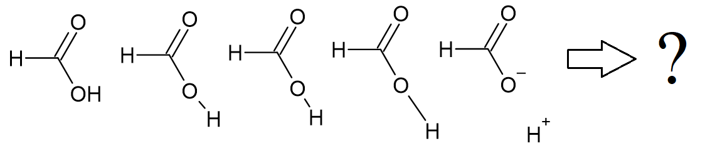

<p align="center">

</p>

[](https://zenodo.org/badge/latestdoi/643202143)

# Gaussian output result files analyser

Interpretation of the [Gaussian](https://gaussian.com/gaussian16/) computational chemistry software output files can be easily done with
the official [GaussView](https://gaussian.com/gaussview6/) program.
However, manually managing dozens or even hundreds of output files becomes impractical. That is where this simple program comes in.
It automates selected data extraction from multiple `.log` or `.out` files
generated by Gaussian 16 or Gaussian 09. This program undergoes [CC BY 4.0](https://github.com/D1s1ntegrator/gaussian-result-analyser/blob/main/LICENSE.md) 
license, which means it is open source and can be used or modified in any way you want, but you must reference the author by full name or [DOI](https://zenodo.org/badge/latestdoi/643202143).
This program does not use any code provided by [Gaussian, Inc.](https://gaussian.com/)

## Features

- Searching for multiple files through folders and subfolders
- Selection of analysis for different [Link1](https://gaussian.com/input/) jobs

Extraction of physical properties is available for:

- SCF ground state energies
- Thermodyanmic (Thermo) information, i. e. Gibbs energy, entropy, etc.
- Counterpoise information
- Distance between selected atoms
- Finding the closest atoms to the selected atom
- Dihedral calculation of selected atoms

## Usage

The program is run from the terminal with the following arguments:
```
python gaussian_results.py [-h] [-f] [--link1] [-c] [-l LABEL] [-n] [-e] [-o]
```

Options:<br />
`-h, --help` show this help message and exit<br />
`-f, --folder` folder with input files<br />
`--link1` do not ignore non-first link1 jobs (for e.g. opt and freq)<br />
`-c, --custom` custom filenames for exported data<br />
`-l LABEL, --label LABEL` specifies the labels during exporting: 0 - no labels, 1 - filename, 2 - folder/filename, 3 - root/folder/filename and so on<br />
`-n, --nested` searches for files through subdirectories<br />
`-e, --extension` specify the extension, .log is the default<br />
`-o, --overwrite` disable overwrite protection

## Code

Python 3.8 was used to create this program. External packages are listed as follows:

- [Numpy](http://www.numpy.org/)
